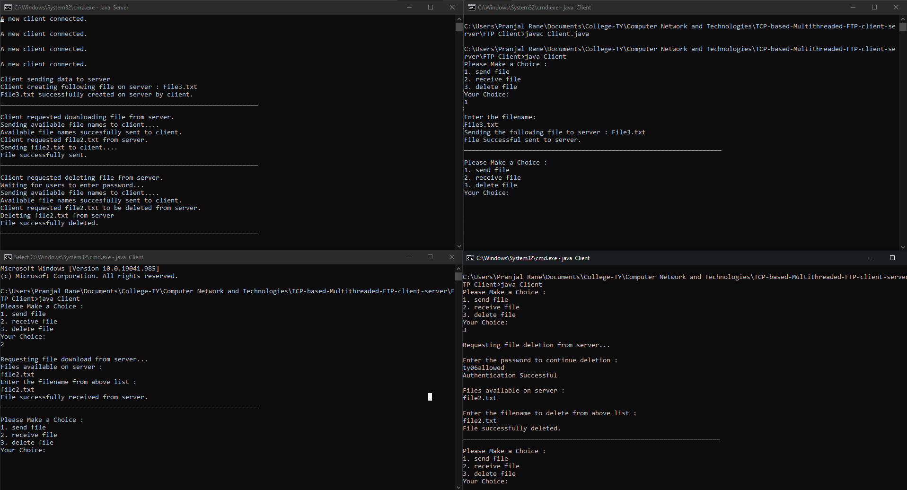

# TCP based Multithreaded FTP Client-Server
A basic multithreaded Client-Server system, written in Java, to simulate a TCP based FTP system.

## Instalation

In order to run the Client and Server Programm you need to have Java JDK installed. [Click here](https://www.oracle.com/in/java/technologies/javase-downloads.html) to install.

## Running
1. Clone this code repository.
```bash
git clone https://github.com/TY-Project-Group/TCP-based-Multithreaded-FTP-client-server.git
```

2. Open a Terminal to run the server code:

```bash
cd '.\FTP Server\'
javac Server.java
java Server
```

3. Open another Terminal to run the Client code:

```bash
cd '.\FTP Client\'
javac Client.java
java Client
```

4. Follow the on-screen instructions.

Note : You can run multiple client nodes, by following step 3 on multiple terminals.

## Result

Sample output screenshot :

